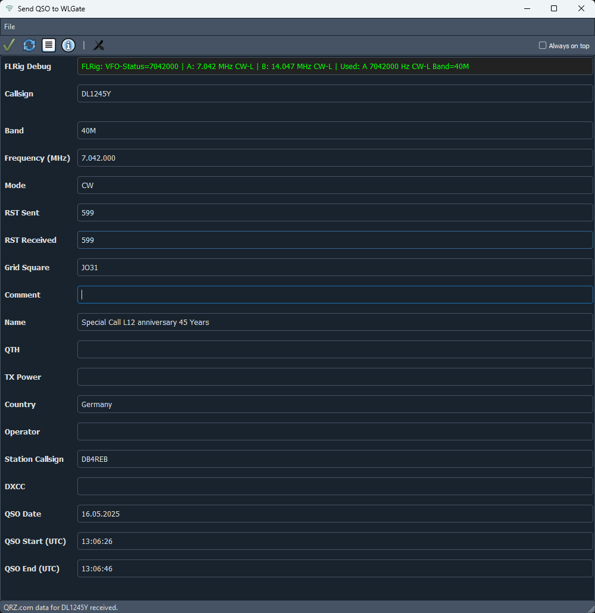

# README.md

## WLSender

**WLSender** is a modern, PyQt5-based application for logging and sending amateur radio QSOs (contacts) via UDP to a WLGate server. It features QRZ.com integration, FLRig support, a flexible and accessible QSO form, and robust error handling and logging.

---

### Features

- **Modern PyQt5 GUI** with resizable, scrollable QSO entry form
- **QRZ.com lookup** for callsign data (name, QTH, country, grid)
- **FLRig integration** for automatic frequency, mode, and band detection
- **ADIF export** and UDP sending to WLGate server
- **Configurable station data** and persistent settings
- **Statusbar with history** and clipboard copy
- **Debug output** for FLRig communication
- **Comprehensive logging** to file (no console spam)
- **Internationalization (i18n)** ready

---

### Installation

1. **Clone the repository:**
    ```sh
    git clone https://github.com/yourusername/wlsender.git
    cd wlsender
    ```

2. **Install dependencies:**
    ```sh
    pip install -r requirements.txt
    ```

---

### Usage

Start the application with:

```sh
python -m src.main
```

- The main window allows you to enter QSO data.
- Callsign lookup via QRZ.com is triggered automatically when leaving the callsign field.
- Frequency, mode, and band can be filled automatically via FLRig (if configured).
- Send the QSO to WLGate via the toolbar or menu.
- Configuration and debug options are available via the config dialog.

---

### Configuration

- Edit your QRZ.com credentials and station information in the config dialog (accessible from the toolbar/menu).
- FLRig and WLGate server addresses/ports are also configurable.

---

### Logging

- All errors and events are logged to `wlsender.log` in the project directory.
- No log output appears on the console.

---

### Requirements

See [requirements.txt](requirements.txt) for all dependencies.

---

### License

MIT License

---

### Credits

- [PyQt5](https://pypi.org/project/PyQt5/)
- [QRZ.com XML API](https://www.qrz.com/xml/)
- [FLRig by W1HKJ](https://github.com/w1hkj/flrig)
- [WLGate by DG4KLU](https://github.com/DG4KLU/WLGate)

---

### Screenshots


Main Window:



Config Dialog:


---

### Support

For issues or feature requests, please use the [GitHub Issues](https://github.com/RebElba42/WLSender/issues) page.
