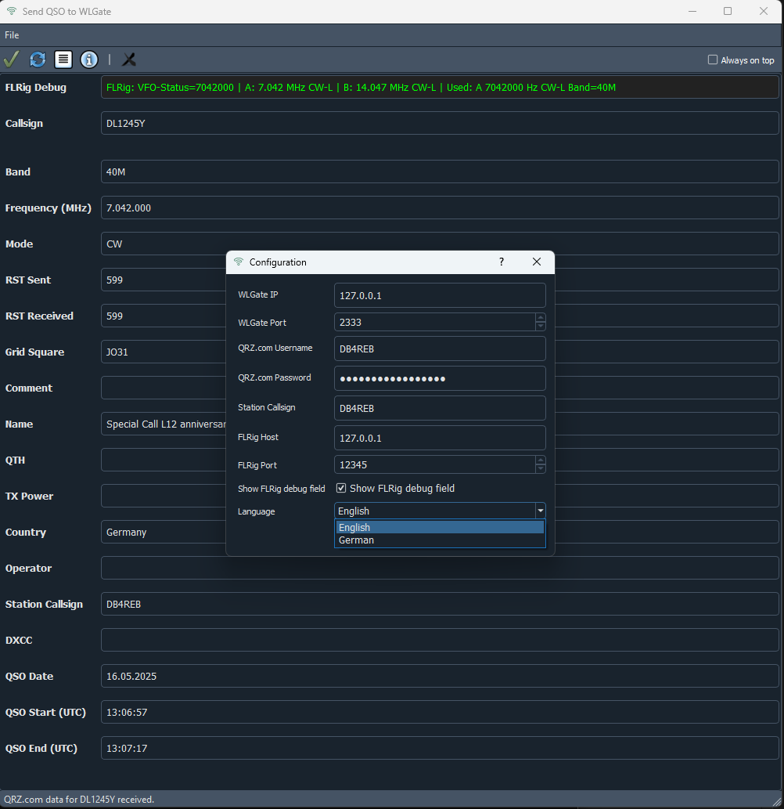
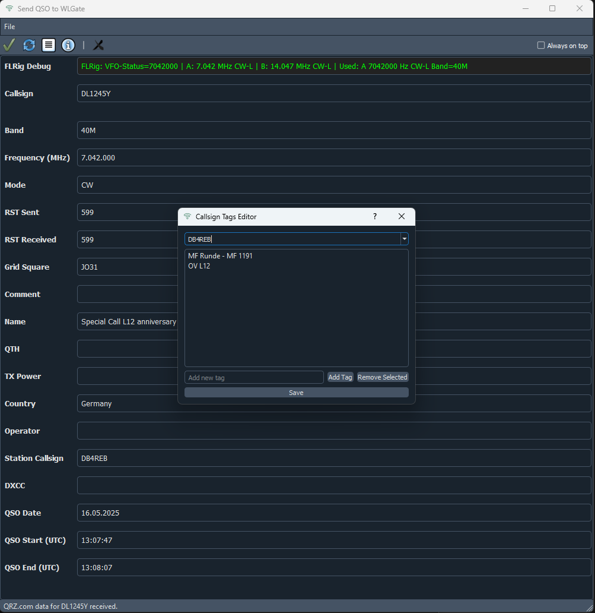

# README.md

## WLSender

**WLSender** is a PyQt5-based application for logging and sending amateur radio QSOs (contacts) via UDP to a WLGate server. It features QRZ.com integration, FLRig support, flexible and accessible QSO form, robust error handling as well as logging.

---

### Features

- **PyQt5 GUI** with resizable, scrollable QSO entry form
- **QRZ.com lookup** for callsign data (name, QTH, country, grid)
- **FLRig integration** for automatic frequency, mode, and band detection
- **ADIF export** via UDP sending to WLGate server
- **Configurable station data** and persistent settings
- **Debug output** for FLRig communication
- **Comprehensive logging** to file (no console out)
- **Internationalization (i18n)** ready

---

### Callsign Tagging

WLSender allows you to assign and manage up to 5 custom tags for any callsign.  
- Tags are displayed as bubbles below the callsign field whenever a matching callsign is entered.
- The tag database is stored as a JSON file in the `data` directory.
- You can add, edit, or remove tags for any callsign using the built-in tag editor dialog, accessible from the toolbar or menu.
- Typical use cases include marking special contacts (e.g., "POTA", "Club Member", "Contest QSO") or adding personal notes to callsigns.

---

### Installation

1. **Clone the repository:**
    ```sh
    git clone https://github.com/RebElba42/WLSender.git
    cd wlsender
    ```

2. **Install dependencies:**
    ```sh
    pip install -r requirements.txt
    ```

---

### Usage

Start the application with:

```sh
python -m src.main
```

- The main window allows you to enter QSO data.
- Callsign lookup via QRZ.com is triggered automatically when leaving the callsign field.
- Frequency, mode, and band can be filled automatically via FLRig (if configured).
- Send the QSO to WLGate via the toolbar or menu.
- Configuration and debug options are available via the config dialog.
- Check "Always on top" in the Tollbar if you wish to have your QSO Window always visible

---

### Configuration

- Edit your QRZ.com credentials and station information in the config dialog (accessible from the toolbar/menu).
- FLRig and WLGate server addresses/ports are also configurable.

**Note:**  
For WLSender to work correctly, both **FLRig** and **WLGate** must be properly installed and running on your system or network.  
Make sure to enter the correct IP addresses and ports for FLRig and WLGate in the configuration dialog.  
Otherwise, features such as automatic frequency/mode detection and QSO sending will not function as expected.

---

### Logging

- All errors and events are logged to `wlsender.log` in the project directory.
- No log output appears on the console.

---

### Requirements

See [requirements.txt](requirements.txt) for all dependencies.

---

### License

MIT License

---

### Credits

- [PyQt5](https://pypi.org/project/PyQt5/)
- QRZ.com XML API
- [FLRig by W1HKJ](https://github.com/w1hkj/flrig)
- [WLGate by DG4KLU](https://github.com/wavelog/WaveLogGate)

---

### Screenshots


Main Window:


Config Dialog:



Tags Edit Dialog:



Tags View:


Send QSO to WLGate (Animated Gif)

[Send QSO to WLGate](images/SendQSO.gif)

---

### Support

For issues or feature requests, please use the [GitHub Issues](https://github.com/RebElba42/WLSender/issues) page.
